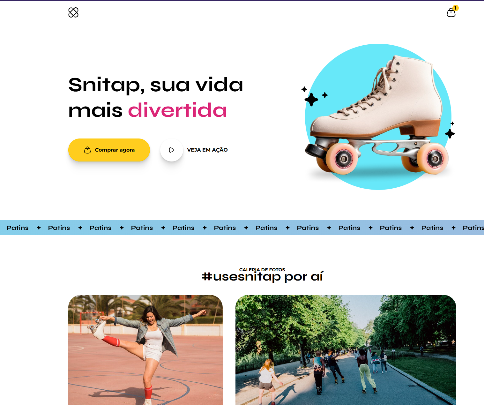

# Snitap Patins

Landing page de uma marca fictícia de patins (Snitap), com hero animado, faixa de banner em movimento contínuo e galeria de fotos.

Demo: https://theusan777.github.io/patins-animation/

## Preview

<p align="center">
  
</p>


## Sobre o projeto

Página de apresentação de um produto (patins), com seção principal de destaque, uma faixa com o texto "Patins" rolando continuamente, e uma galeria de fotos com a hashtag #usesnitap. O objetivo foi treinar animação de elementos na tela, junto com um layout de landing page mais próximo de um site comercial real.

## Tecnologias

- HTML
- CSS
- JavaScript (efeito de texto alternando no título e a faixa de banner em movimento contínuo)

## Funcionalidades

- Seção principal com título animado e botões de call to action
- Faixa de banner com rolagem contínua
- Galeria de fotos com legenda de Instagram
- Rodapé com links e ícones de redes sociais

## Estrutura do projeto

```
index.html
assets/
  logo.svg
  banner.svg
  hero/
  icons/
  images/
```

## Como executar

git clone https://github.com/theusan777/patins-animation.git

Depois é só abrir o `index.html` no navegador.

## Deploy

[Acessar projeto](https://theusan777.github.io/patins-animation/)

## Aprendizados

Foi o primeiro projeto em que mexi de fato com animação (texto alternando e faixa rolando continuamente), em vez de só layout estático.
